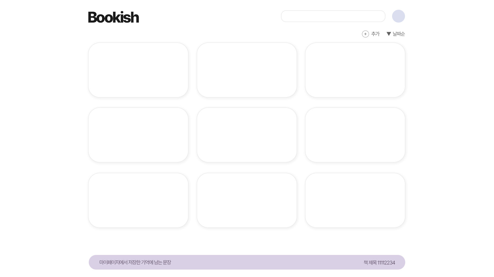

# BOOKISH

: 독서 기록 웹사이트
  

## ⚙ <b>기술 스택</b>

 

 
 

  

## 🎈 <b>개발 예정 기능</b>

### 1. 기록

- 표지, 제목, 저자, 날짜, 별점, 키워드, 내용
- 상세페이지
- 편집, 삭제

### 2 . 검색

- 읽고 싶은 책 검색

### 3. ❤ 리스트

- 읽고 싶은 책 모음

### 4. 정렬

- 날짜, 기록일, 가나다, 별점

### 5. 마이페이지

- 문장 기록
- 정보 변경
- ❤ 리스트 확인

### 6. 회원

- 가입, 로그인, 로그아웃
- 로그인 되어 있지 않을 시 모달창
- 회원 DB 관리
- 관리자 DB 고민 중

 

<!-- ##### + 예상 디자인 -->

<!--  -->

  

## 🔉 <b>진행상황</b>

- [x] 데이터베이스 연동
